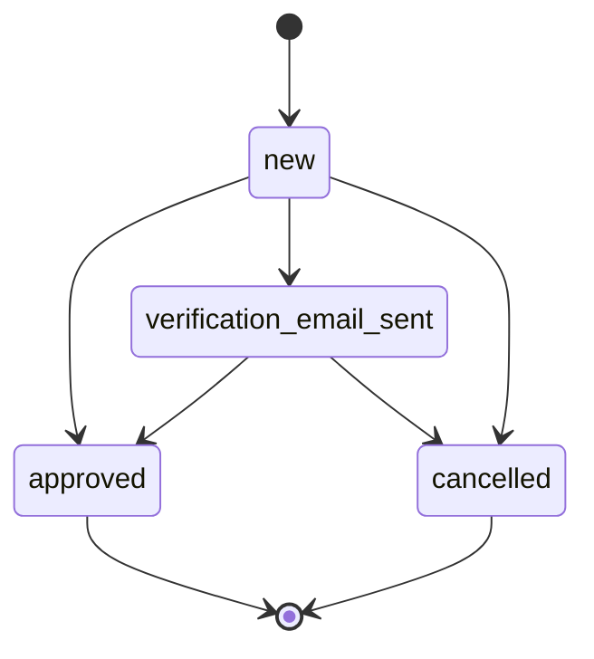

# Updating the reporter information of a signal

Date: 2023-06-14
Author: Youri Westerman

## Status

2023-06-14 - Draft (Youri Westerman)
2023-08-04 - Final (Youri Westerman)

## Context

It should be possible to update the contact information of reporters of a signal.
This can happen when for example a mistake is made when entering the phone number
or email address of a reporter.

Allowing the phone number and/or email address to be updated is a lot more
user-friendly than having to create a new signal, especially when the old signal
is already being handled.

In order to verify if a new email address actually correct we require a
verification process.

A reporter is its own entity in the database which is linked to a signal using a
bidirectional one-to-one relation. However, multiple reporters can be linked to the
same signal. This makes a single reporter the current reporter for the signal and
allows for keeping track of changes to the signal's reporter information.

## Decision

Because we do want and need to keep track of the old reporter data, we decided
that in order for the contact information to be updated a new reporter should be
created in the database. In order to prevent the private signal API endpoint
from becoming even more complicated than it already is, we will create 2 new
API endpoints:

- Create endpoint (allowing to create a new reporter)
- List endpoint (allowing retrieval of all signal reporters, in order to verify
the verification state)

The private signal endpoint includes the "current" reporter, which could be the
original reporter or the latest verified reporter.

### Verification

To assure that a new email address is correct and belongs to the actual reporter
we decided that a verification process is in order.
That means that when there is a change between the previous and the new email
address, the following will happen:

1. An email is sent to the original email address, stating that a request has been
received to alter the email address of the signal.
2. A verification email is sent to the new email address. This email will contain
a link for the reporter to click on. The link contains a verification token that
is stored in the database so that we can verify it when it's clicked.

The verification token should expire after a configurable period of time.

After an update of the reporter we should send an email stating that the reporter
information was updated to the email address of the reporter if it is available.

### Architecture

In order to have a clear and concise way to manage the updates we have decided to
use a state machine. See the diagram below.

After careful consideration we decided that the
[`django-fsm`](https://github.com/viewflow/django-fsm) package is the best tool
available to help us implement the state machine and manage the states and
transitions.
