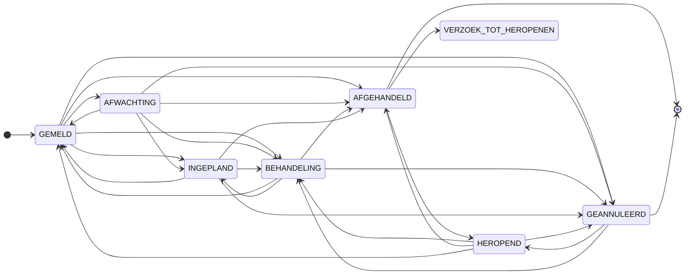

# State Machine
## Statussen Release 1

```mermaid

stateDiagram-v2
    direction LR

    [*] --> GEMELD

    GEMELD --> AFWACHTING
    GEMELD --> BEHANDELING
    GEMELD --> AFGEHANDELD
    GEMELD --> GEANNULEERD
    GEMELD --> INGEPLAND

    AFWACHTING --> GEMELD
    AFWACHTING --> INGEPLAND
    AFWACHTING --> AFGEHANDELD
    AFWACHTING --> BEHANDELING
    AFWACHTING --> GEANNULEERD

    BEHANDELING --> GEMELD
    BEHANDELING --> INGEPLAND
    BEHANDELING --> AFGEHANDELD
    BEHANDELING --> GEANNULEERD

    INGEPLAND --> GEMELD
    INGEPLAND --> BEHANDELING
    INGEPLAND --> AFGEHANDELD
    INGEPLAND --> GEANNULEERD
    
    GEANNULEERD --> HEROPEND
    GEANNULEERD --> BEHANDELING

    AFGEHANDELD --> HEROPEND
    AFGEHANDELD --> VERZOEK_TOT_HEROPENEN

    HEROPEND --> BEHANDELING
    HEROPEND --> AFGEHANDELD
    HEROPEND --> GEANNULEERD
    HEROPEND --> GEMELD

    
    AFGEHANDELD --> [*]
    GEANNULEERD --> [*]
```
