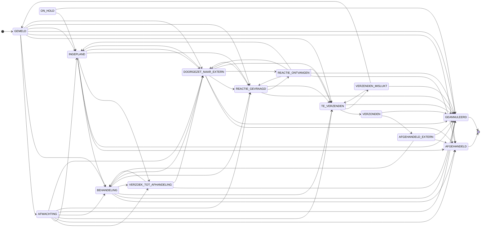

# State Machine
## Diagram

```mermaid

stateDiagram-v2
    direction LR

    [*] --> GEMELD

%%    GEMELD --> GEMELD
    GEMELD --> AFWACHTING
    GEMELD --> BEHANDELING
    GEMELD --> TE_VERZENDEN
    GEMELD --> AFGEHANDELD
    GEMELD --> GEANNULEERD
    GEMELD --> INGEPLAND
    GEMELD --> REACTIE_GEVRAAGD
    GEMELD --> DOORGEZET_NAAR_EXTERN

%%    AFWACHTING --> GEMELD
%%    AFWACHTING --> AFWACHTING
    AFWACHTING --> INGEPLAND
    AFWACHTING --> VERZOEK_TOT_AFHANDELING
    AFWACHTING --> AFGEHANDELD
    AFWACHTING --> TE_VERZENDEN
    AFWACHTING --> BEHANDELING
    AFWACHTING --> GEANNULEERD
    AFWACHTING --> REACTIE_GEVRAAGD
    AFWACHTING --> DOORGEZET_NAAR_EXTERN

%%    BEHANDELING --> GEMELD
%%    BEHANDELING --> INGEPLAND
%%    BEHANDELING --> BEHANDELING
    BEHANDELING --> AFGEHANDELD
    BEHANDELING --> GEANNULEERD
    BEHANDELING --> TE_VERZENDEN
    BEHANDELING --> VERZOEK_TOT_AFHANDELING
    BEHANDELING --> REACTIE_GEVRAAGD
    BEHANDELING --> DOORGEZET_NAAR_EXTERN
%%
%%    INGEPLAND --> GEMELD
%%    INGEPLAND --> INGEPLAND
    INGEPLAND --> BEHANDELING
    INGEPLAND --> AFGEHANDELD
    INGEPLAND --> GEANNULEERD
    INGEPLAND --> VERZOEK_TOT_AFHANDELING
    INGEPLAND --> REACTIE_GEVRAAGD
    INGEPLAND --> DOORGEZET_NAAR_EXTERN

    ON_HOLD --> INGEPLAND
    ON_HOLD --> GEANNULEERD

    TE_VERZENDEN --> VERZONDEN
    TE_VERZENDEN --> VERZENDEN_MISLUKT
    TE_VERZENDEN --> GEANNULEERD

    VERZONDEN --> AFGEHANDELD_EXTERN
    VERZONDEN --> GEANNULEERD

    VERZENDEN_MISLUKT --> GEMELD
    VERZENDEN_MISLUKT --> TE_VERZENDEN
    VERZENDEN_MISLUKT --> GEANNULEERD

    AFGEHANDELD_EXTERN --> AFGEHANDELD
    AFGEHANDELD_EXTERN --> GEANNULEERD
    AFGEHANDELD_EXTERN --> BEHANDELING

%%    AFGEHANDELD --> HEROPEND
%%    AFGEHANDELD --> VERZOEK_TOT_HEROPENEN

%%    GEANNULEERD --> GEANNULEERD
%%    GEANNULEERD --> HEROPEND
%%    GEANNULEERD --> BEHANDELING

%%    HEROPEND --> HEROPEND
%%    HEROPEND --> BEHANDELING
%%    HEROPEND --> AFGEHANDELD
%%    HEROPEND --> GEANNULEERD
%%    HEROPEND --> TE_VERZENDEN
%%    HEROPEND --> GEMELD
%%    HEROPEND --> REACTIE_GEVRAAGD
%%    HEROPEND --> DOORGEZET_NAAR_EXTERN

%%    GESPLITST

%%    VERZOEK_TOT_AFHANDELING --> GEMELD
%%    VERZOEK_TOT_AFHANDELING --> VERZOEK_TOT_AFHANDELING
%%    VERZOEK_TOT_AFHANDELING --> AFWACHTING
%%    VERZOEK_TOT_AFHANDELING --> AFGEHANDELD
    VERZOEK_TOT_AFHANDELING --> GEANNULEERD
    VERZOEK_TOT_AFHANDELING --> BEHANDELING
    VERZOEK_TOT_AFHANDELING --> DOORGEZET_NAAR_EXTERN

    %%    VERZOEK_TOT_HEROPENEN --> AFGEHANDELD
    %%    VERZOEK_TOT_HEROPENEN --> HEROPEND
    %%    VERZOEK_TOT_HEROPENEN --> GEANNULEERD

%%    REACTIE_GEVRAAGD --> GEMELD
%%    REACTIE_GEVRAAGD --> AFWACHTING
%%    REACTIE_GEVRAAGD --> BEHANDELING
%%    REACTIE_GEVRAAGD --> INGEPLAND
%%    REACTIE_GEVRAAGD --> AFGEHANDELD
    REACTIE_GEVRAAGD --> GEANNULEERD
%%    REACTIE_GEVRAAGD --> REACTIE_GEVRAAGD
    REACTIE_GEVRAAGD --> REACTIE_ONTVANGEN
    REACTIE_GEVRAAGD --> TE_VERZENDEN
    REACTIE_GEVRAAGD --> DOORGEZET_NAAR_EXTERN

%%    REACTIE_ONTVANGEN --> GEMELD
%%    REACTIE_ONTVANGEN --> AFWACHTING
%%    REACTIE_ONTVANGEN --> BEHANDELING
    REACTIE_ONTVANGEN --> AFGEHANDELD
    REACTIE_ONTVANGEN --> GEANNULEERD
    REACTIE_ONTVANGEN --> INGEPLAND
    REACTIE_ONTVANGEN --> REACTIE_GEVRAAGD
    REACTIE_ONTVANGEN --> TE_VERZENDEN
    REACTIE_ONTVANGEN --> DOORGEZET_NAAR_EXTERN

%%    DOORGEZET_NAAR_EXTERN --> VERZOEK_TOT_AFHANDELING
%%    DOORGEZET_NAAR_EXTERN --> GEMELD
%%    DOORGEZET_NAAR_EXTERN --> AFWACHTING
%%    DOORGEZET_NAAR_EXTERN --> BEHANDELING
%%    DOORGEZET_NAAR_EXTERN --> DOORGEZET_NAAR_EXTERN
    DOORGEZET_NAAR_EXTERN --> INGEPLAND
    DOORGEZET_NAAR_EXTERN --> AFGEHANDELD
    DOORGEZET_NAAR_EXTERN --> GEANNULEERD
    DOORGEZET_NAAR_EXTERN --> REACTIE_GEVRAAGD
    DOORGEZET_NAAR_EXTERN --> REACTIE_ONTVANGEN
    DOORGEZET_NAAR_EXTERN --> TE_VERZENDEN
    
    AFGEHANDELD --> [*]
    GEANNULEERD --> [*]
```
